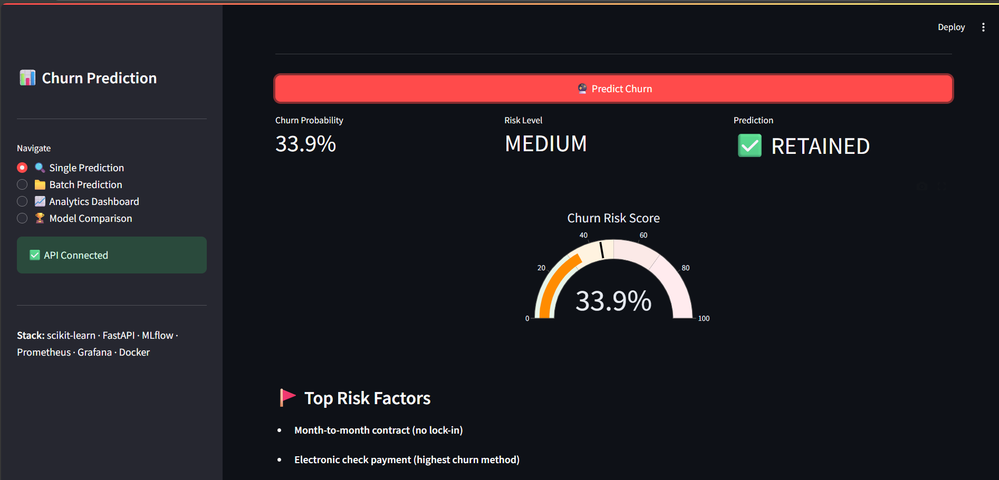
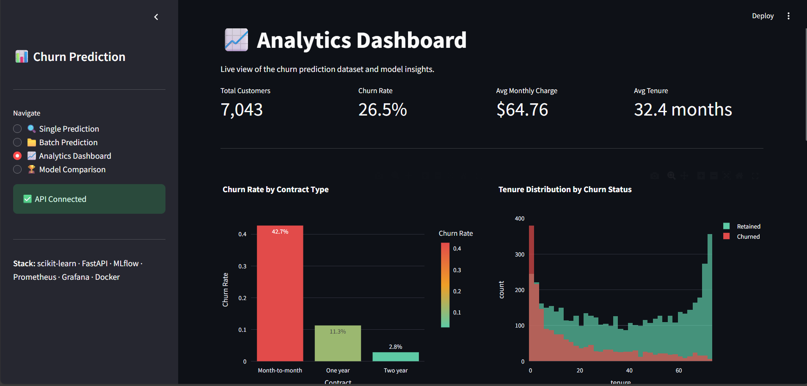
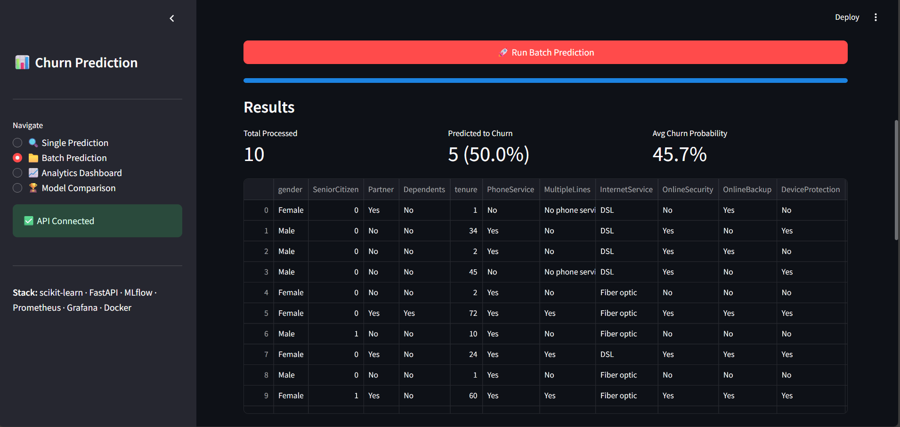
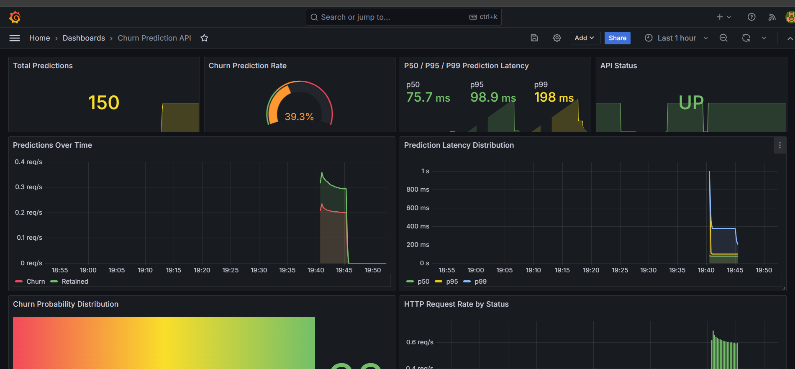
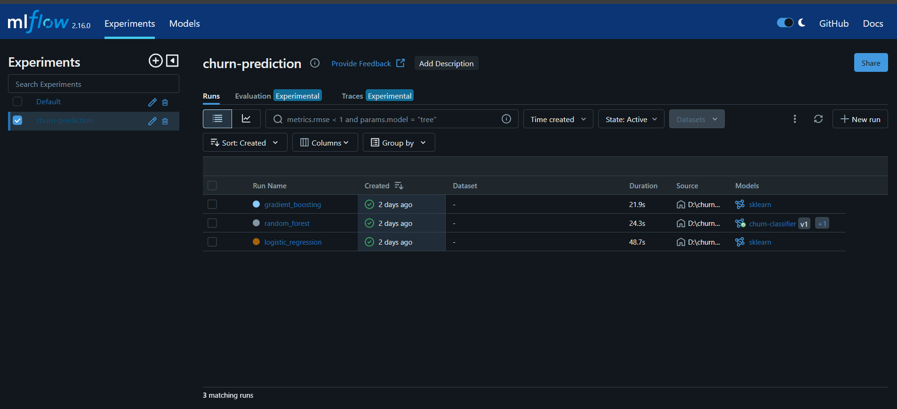

# Customer Churn Prediction — End-to-End ML System

A production-style machine learning system that predicts customer churn using the Telco Customer Churn dataset. This project demonstrates the full ML lifecycle — from exploratory analysis to a monitored, containerized prediction service with an interactive frontend.



## What This Project Demonstrates

- **ML Pipeline**: Data validation → feature engineering → model training → threshold tuning → evaluation
- **MLOps**: Experiment tracking, model comparison, and model registry with MLflow
- **Serving**: Real-time prediction API with FastAPI and Prometheus instrumentation
- **Monitoring**: Grafana dashboard with prediction metrics, latency percentiles, and business KPIs
- **Frontend**: Interactive Streamlit app with single/batch prediction, analytics, and model comparison
- **Deployment**: Fully containerized with Docker Compose (API + MLflow + Prometheus + Grafana + Streamlit)

## Screenshots

### Streamlit — Analytics Dashboard


### Streamlit — Batch Prediction


### Streamlit — Model Comparison


### Grafana — Production Monitoring


### MLflow — Experiment Tracking


## Architecture

```
┌──────────┐     ┌──────────────┐     ┌──────────────┐
│ Raw Data │────▶│ Preprocessing│────▶│   Training   │
│  (CSV)   │     │   Pipeline   │     │  + MLflow    │
└──────────┘     └──────┬───────┘     └──────┬───────┘
                        │                     │
                Serialized pipeline    Best model + threshold
                        │                     │
                        ▼                     ▼
                 ┌────────────────────────────────┐
                 │       FastAPI Service           │
                 │  /predict  /health  /metrics    │
                 └────────┬───────────┬───────────┘
                          │           │
                ┌─────────┘           └─────────┐
                ▼                               ▼
          ┌───────────┐                  ┌───────────┐
          │Prometheus │─────────────────▶│  Grafana   │
          └───────────┘                  └───────────┘
                ▲
                │
          ┌───────────┐
          │ Streamlit  │
          │ Frontend   │
          └───────────┘
```

## Key Technical Decisions

**Shared preprocessing pipeline**: The same scikit-learn `Pipeline` object is serialized with `joblib` and used in both training and inference. This eliminates train/serve skew — the most common source of silent production bugs in ML systems.

**Threshold tuning over default 0.5**: The optimal classification threshold is found by maximizing F1 on the precision-recall curve. For churn, the business cost of missing a churning customer differs from the cost of a false alarm — the threshold should reflect that tradeoff, not an arbitrary default.

**PR-AUC as primary metric**: With ~26% churn rate, ROC-AUC can be misleadingly optimistic. PR-AUC gives a more honest picture of model performance on the minority class.

**Class-weight balancing over SMOTE**: `class_weight='balanced'` is simpler, has no risk of data leakage, and achieves equivalent performance on this dataset. SMOTE adds complexity without proportional benefit here.

**Rule-based risk factors**: The API returns human-readable risk factors alongside predictions. In production this would use SHAP values — for a portfolio project, rule-based explanations demonstrate the same product thinking with less overhead.

## Results

| Model | PR-AUC | ROC-AUC | F1 | Precision | Recall |
|-------|--------|---------|-----|-----------|--------|
| Logistic Regression | 0.598 | 0.843 | 0.601 | 0.548 | 0.743 |
| **Random Forest** | **0.654** | **0.847** | **0.612** | **0.525** | **0.821** |
| Gradient Boosting | 0.649 | 0.845 | 0.607 | 0.548 | 0.738 |

Random Forest was selected as the best model based on PR-AUC. The tuned threshold of 0.445 (vs default 0.5) prioritizes recall — catching more at-risk customers at the cost of some false positives. In a real business setting, this tradeoff would be calibrated with the retention team based on the cost of intervention vs the lifetime value of a saved customer.

## Project Structure

```
churn-prediction/
├── configs/
│   └── model_config.yaml
├── data/
│   ├── raw/                # telco_churn.csv (gitignored)
│   ├── processed/          # train/test splits (gitignored)
│   └── sample_batch.csv    # Sample CSV for batch prediction
├── docs/
│   └── images/             # Screenshots for README
├── grafana/
│   ├── dashboards/         # Auto-provisioned Grafana dashboard
│   └── provisioning/       # Datasource + dashboard config
├── outputs/
│   ├── figures/            # EDA + evaluation plots
│   ├── models/             # Serialized model + pipeline
│   └── reports/            # Classification reports
├── scripts/
│   ├── run_eda.py          # Exploratory data analysis
│   ├── train.py            # Full training pipeline
│   ├── evaluate.py         # Standalone evaluation
│   └── load_test.py        # Generate API traffic for monitoring
├── src/
│   ├── api/                # FastAPI app, schemas, Prometheus metrics
│   ├── data/               # Load, validate, split
│   ├── features/           # Preprocessing pipeline (shared train/serve)
│   ├── models/             # Train, evaluate, threshold tuning
│   └── utils/              # Config loader, logger
├── streamlit_app.py        # Interactive frontend
├── docker-compose.yml      # Full stack orchestration
├── Dockerfile              # Multi-stage API container
├── prometheus.yml          # Prometheus scrape config
├── requirements.txt
├── .gitignore
├── .dockerignore
└── README.md
```

## Quick Start

**Requirements:** Python 3.11+, Docker, Docker Compose, and the [Telco Customer Churn dataset](https://www.kaggle.com/datasets/blastchar/telco-customer-churn) saved as `data/raw/telco_churn.csv`.

### Setup & Train

```bash
# Clone and setup
git clone https://github.com/Ratna7888/churn-prediction.git
cd churn-prediction
python -m venv .venv && source .venv/bin/activate  # Windows: .venv\Scripts\activate
pip install -r requirements.txt

# Run EDA (optional — generates plots in outputs/figures/)
python -m scripts.run_eda

# Start MLflow and train models
mlflow server --host 0.0.0.0 --port 5001 --backend-store-uri sqlite:///mlflow.db
# In a new terminal:
python -m scripts.train
```

### Launch Full Stack with Docker

```bash
docker-compose up --build
```

This starts all backend services:

| Service | URL | Purpose |
|---------|-----|---------|
| FastAPI | http://localhost:8000/docs | Prediction API + Swagger |
| MLflow | http://localhost:5001 | Experiment tracking |
| Grafana | http://localhost:3000 | Monitoring dashboard (admin/admin) |
| Prometheus | http://localhost:9090 | Metrics collection |

### Launch Streamlit Frontend

In a separate terminal (runs locally to access data and MLflow):

```bash
streamlit run streamlit_app.py
```

Opens at http://localhost:8501 with four pages: Single Prediction, Batch Prediction, Analytics Dashboard, and Model Comparison.

### Generate Monitoring Data

```bash
python -m scripts.load_test --n 150 --delay 0.1
```

### Test the API Directly

```bash
curl -X POST http://localhost:8000/predict \
  -H "Content-Type: application/json" \
  -d '{
    "gender": "Female",
    "SeniorCitizen": 0,
    "Partner": "Yes",
    "Dependents": "No",
    "tenure": 1,
    "PhoneService": "No",
    "MultipleLines": "No phone service",
    "InternetService": "DSL",
    "OnlineSecurity": "No",
    "OnlineBackup": "Yes",
    "DeviceProtection": "No",
    "TechSupport": "No",
    "StreamingTV": "No",
    "StreamingMovies": "No",
    "Contract": "Month-to-month",
    "PaperlessBilling": "Yes",
    "PaymentMethod": "Electronic check",
    "MonthlyCharges": 29.85,
    "TotalCharges": 29.85
  }'
```

**Response:**
```json
{
  "will_churn": true,
  "churn_probability": 0.7234,
  "threshold": 0.4453,
  "risk_level": "critical",
  "top_risk_factors": [
    "Month-to-month contract (no lock-in)",
    "Short tenure (1 months)",
    "Electronic check payment (highest churn method)"
  ]
}
```

## Monitoring

The Grafana dashboard auto-provisions on startup and tracks:

- **Total predictions** served and churn prediction rate
- **P50 / P95 / P99** prediction latency
- **Predictions over time** (churn vs retained)
- **Churn probability distribution** across requests
- **HTTP request rate** by status code
- **API health** status

Custom Prometheus metrics exposed at `/metrics`:
- `predictions_total` — counter by result (churn/retained)
- `prediction_probability` — histogram of returned probabilities
- `prediction_latency_seconds` — inference time histogram
- `model_info` — currently loaded model metadata

## What I'd Add in Production

- **SHAP explanations** for per-prediction feature importance
- **Data drift detection** using Evidently or custom statistical tests
- **A/B testing** framework for comparing models in production
- **CI/CD pipeline** with automated retraining triggers
- **Feature store** to decouple feature engineering from training/serving
- **Horizontal scaling** with multiple API replicas behind a load balancer

## Tech Stack

Python · scikit-learn · FastAPI · Streamlit · MLflow · Prometheus · Grafana · Docker · Docker Compose